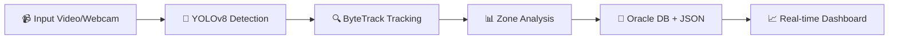
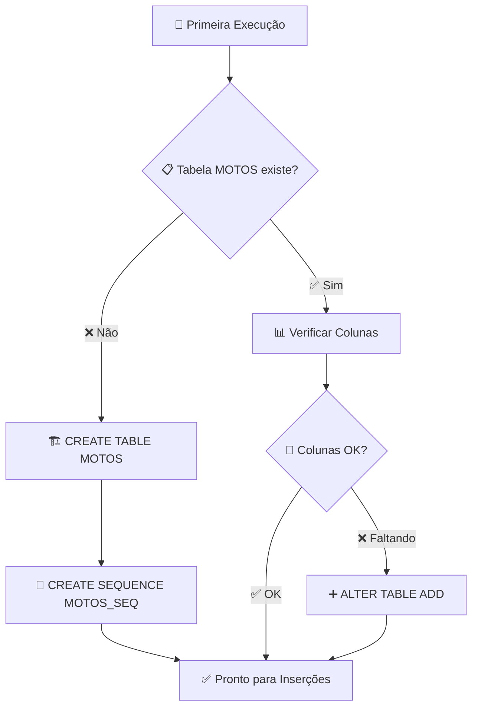
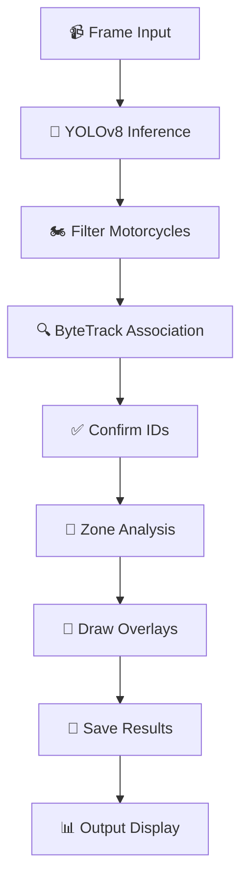

# 🏍️ GeoSense — Detecção e Rastreamento de Motos

<div align="center">


**🚀 Sistema inteligente para detecção e rastreamento de motocicletas em tempo real**

_Powered by YOLOv8 + ByteTrack + Oracle Integration_

</div>

---

## 👥 **Equipe Geosense**

<div align="center">

|       🧑‍💻 **Desenvolvedor**       | 📧 **RA/Email** |
| :------------------------------: | :-------------: |
|    **Rafael de Souza Pinto**     |   `RM 555130`   |
| **Luiz Paulo Freitas Fernandes** |   `RM 555497`   |
|    **Enzo Giuseppe Marsola**     |   `RM 556310`   |

</div>

## 🎯 **O que o sistema faz**

<div align="center">



</div>

### ✨ **Principais Funcionalidades**

| 🔧 **Funcionalidade**       | 📝 **Descrição**                                                |
| :-------------------------- | :-------------------------------------------------------------- |
| 🎯 **Detecção Inteligente** | Detecta motos com modelos YOLOv8 (Ultralytics) de alta precisão |
| 🔄 **Rastreamento Robusto** | ByteTrack via Supervision para IDs estáveis ao longo do tempo   |
| 🖥️ **Interface Visual**     | Overlay com caixas, rótulos, FPS e HUD em tempo real            |
| 🗺️ **Análise por Zonas**    | Contagem por áreas definidas em `zones_example.json`            |
| 📋 **Registro Incremental** | Gera JSON com motos únicas detectadas em `runs/motos.json`      |
| 🗄️ **Integração Oracle**    | Persistência automática na tabela `MOTOS`                       |
| 🎮 **Menu Amigável**        | Interface gráfica (Tkinter) ou console no Windows               |

---

## 🏢 **Por que isso revoluciona a operação da Mottu**

<div align="center">

### 🎯 **Impacto Operacional**

</div>

| 💡 **Benefício**          | 🚀 **Resultado**                                        |
| :------------------------ | :------------------------------------------------------ |
| 🤖 **Automação Completa** | Reduz esforço manual em 90% na fiscalização de pátios   |
| 📊 **Visibilidade 360°**  | Zonas permitem monitorar gargalos, filas e ocupação     |
| 🔗 **Integração Nativa**  | Dados estruturados (JSON + Oracle) para dashboards e BI |
| ⚡ **Escalabilidade**     | CPU para pilotos rápidos, GPU para alta demanda         |
| 📈 **ROI Imediato**       | Otimização de espaço e fluxo = redução de custos        |

---

## 📋 **Requisitos do Sistema**

<div align="center">

### 🖥️ **Ambiente Recomendado**

</div>

| 🔧 **Componente**    | 📌 **Versão/Especificação**       | ⚡ **Observação**                           |
| :------------------- | :-------------------------------- | :------------------------------------------ |
| 🐍 **Python**        | 3.10+                             | Windows recomendado (Linux/macOS suportado) |
| 📹 **Input**         | Webcam ou arquivo de vídeo/imagem | Formatos: MP4, AVI, JPG, PNG, etc.          |
| 🎮 **GPU**           | NVIDIA com CUDA _(opcional)_      | Para máxima performance                     |
| 🗄️ **Oracle Client** | Thin mode _(opcional)_            | Para persistência de dados                  |

---

## 🚀 **Instalação (Windows PowerShell)**

<div align="center">

### ⚡ **Setup Rápido em 3 Passos**

</div>

### 📦 **Passo 1: Preparar Ambiente**

```powershell
cd C:\Users\Rafael\Desktop\iotSprint2
python -m venv .venv
.\.venv\Scripts\Activate.ps1
python -m pip install --upgrade pip
```

### 🔥 **Passo 2: Instalar PyTorch (Escolha UMA opção)**

**💻 Para CPU (mais compatível):**

```powershell
pip install torch torchvision --index-url https://download.pytorch.org/whl/cpu
```

**🚀 Para GPU NVIDIA (performance máxima):**

```powershell
pip install torch torchvision --index-url https://download.pytorch.org/whl/cu121
```

### ⚡ **Passo 3: Instalar Dependências**

```powershell
pip install -r requirements.txt
```

<div align="center">

> 💡 **Dica Pro:** O script reexecuta automaticamente com o Python do venv no Windows!

</div>

---

## 🎮 **Uso Rápido (Menu Interativo)**

```powershell
python geosense_tracker.py --show
```

<div align="center">

### 🖼️ **Interface Amigável**

|                              🪟 **Windows**                              |                             🖥️ **Console**                              |
| :----------------------------------------------------------------------: | :---------------------------------------------------------------------: |
|  |  |
|                        Menu gráfico com 3 botões                         |                           Fallback automático                           |

</div>

**🎯 Opções disponíveis:**

- 📹 **Vídeo:** Processar arquivo de vídeo
- 🖼️ **Imagem:** Análise de imagem única
- 📷 **Webcam:** Captura em tempo real

> 🔄 **Retorno automático ao menu** após cada execução | ❌ **Sair:** Feche a janela ou digite "q"

---

## ⚙️ **Parâmetros de Configuração**

<div align="center">

### 🎛️ **Controles Avançados**

</div>

<details>
<summary><b>📂 Input/Output</b></summary>

| 🔧 **Parâmetro** | 📝 **Descrição**        | 💡 **Exemplo**     |
| :--------------- | :---------------------- | :----------------- |
| `--source`       | Arquivo de vídeo/imagem | `.\video.mp4`      |
| `--webcam`       | Índice da webcam        | `--webcam 0`       |
| `--save`         | Salvar vídeo anotado    | `--save`           |
| `--output`       | Caminho de saída        | `.\runs\saida.mp4` |

</details>

<details>
<summary><b>🤖 IA & Detecção</b></summary>

| 🔧 **Parâmetro** | 📝 **Descrição**       | 🎯 **Padrão** |
| :--------------- | :--------------------- | :------------ |
| `--model`        | Modelo YOLO            | `yolov8n.pt`  |
| `--conf`         | Confiança mínima       | `0.35`        |
| `--iou`          | IoU do NMS             | `0.60`        |
| `--device`       | Dispositivo            | `cpu`/`cuda`  |
| `--imgsz`        | Tamanho da imagem      | `960`         |
| `--tta`          | Test-Time Augmentation | `False`       |

</details>

<details>
<summary><b>🔍 Rastreamento</b></summary>

| 🔧 **Parâmetro**     | 📝 **Descrição**         | 🎯 **Padrão** |
| :------------------- | :----------------------- | :------------ |
| `--min-track-frames` | Frames para confirmar ID | `3`           |
| `--track-buffer`     | Persistência do track    | `60`          |
| `--track-thresh`     | Confiança mínima         | `0.50`        |
| `--match-thresh`     | Limiar de matching       | `0.80`        |

</details>

<details>
<summary><b>💻 Sistema & Interface</b></summary>

| 🔧 **Parâmetro** | 📝 **Descrição** | 🎯 **Opções**           |
| :--------------- | :--------------- | :---------------------- |
| `--backend`      | Backend webcam   | `auto`, `dshow`, `msmf` |
| `--show`         | Exibir janela    | `True`/`False`          |
| `--half`         | Half precision   | `True`/`False`          |
| `--max-frames`   | Limite de frames | `0` (infinito)          |

</details>

---

## 🗺️ **Zonas Inteligentes (Análise por Área)**

<div align="center">

### 📍 **Monitoramento Geoespacial**

</div>

**🎯 Configuração em `zones_example.json`:**

```json
{
  "frame_reference": [1280, 720],
  "normalized": true,
  "zones": [
    {
      "id": "A",
      "points": [
        [0.02, 0.1],
        [0.48, 0.1],
        [0.48, 0.95],
        [0.02, 0.95]
      ]
    },
    {
      "id": "B",
      "points": [
        [0.52, 0.1],
        [0.98, 0.1],
        [0.98, 0.95],
        [0.52, 0.95]
      ]
    }
  ]
}
```

<div align="center">

| 🔧 **Propriedade** | 📝 **Descrição**             | 💡 **Exemplo**            |
| :----------------- | :--------------------------- | :------------------------ |
| `normalized: true` | Coordenadas relativas (0..1) | Escala automática         |
| `frame_reference`  | Resolução de referência      | `[1280, 720]`             |
| `points`           | Vértices do polígono         | `[[x1,y1], [x2,y2], ...]` |

> 🎯 **Customize as zonas** conforme o layout do seu pátio!

</div>

---

## 🗄️ **Integração Oracle Database**

<div align="center">

### 💾 **Persistência Transacional**


</div>

**📋 Estrutura da Tabela `MOTOS`:**

| 🔧 **Coluna** | 📊 **Tipo**    | 📝 **Descrição**         |
| :------------ | :------------- | :----------------------- |
| `X`           | `NUMBER(10,2)` | Coordenada X da detecção |
| `Y`           | `NUMBER(10,2)` | Coordenada Y da detecção |
| `DETECTED_AT` | `TIMESTAMP`    | Timestamp da detecção    |

**🔗 Configuração Padrão:**

- 🏠 **Host:** `oracle.fiap.com.br`
- 🚪 **Porta:** `1521`
- 🎯 **Service:** `orcl`
- 👤 **Usuário:** `RM555130`

<details>
<summary><b>⚙️ Configuração Avançada</b></summary>

```powershell
# Variáveis de ambiente (PowerShell)
$env:ORACLE_USER = "RM555130"
$env:ORACLE_PASSWORD = "040506"
$env:ORACLE_HOST = "oracle.fiap.com.br"
$env:ORACLE_PORT = "1521"
$env:ORACLE_SERVICE = "orcl"
```

**📋 Pré-requisitos:**

- ✅ Driver `oracledb` incluído no `requirements.txt`
- 🔧 **Modo Thin:** Sem Oracle Client (padrão)
- ⚡ **Modo Thick:** Instale Instant Client + configurar `PATH`

**⚠️ Observações:**

- 🚀 **Auto-criação:** Tabela criada automaticamente
- 🛡️ **Fail-safe:** Falhas não interrompem detecção
- 📝 **Logs:** Avisos registrados no console

</details>

---

## 🗄️ **Estrutura da Tabela Oracle (`MOTOS`)**

<div align="center">

### 📊 **Schema da Tabela Auto-Criada**


</div>

O sistema **cria automaticamente** a tabela `MOTOS` na primeira execução, com todos os índices e sequências necessárias.

### 🏗️ **DDL da Tabela Criada**

```sql
CREATE TABLE MOTOS (
    ID NUMBER GENERATED BY DEFAULT AS IDENTITY,
    TRACK_ID NUMBER NULL,
    X NUMBER(10,2) NOT NULL,
    Y NUMBER(10,2) NOT NULL,
    DETECTED_AT TIMESTAMP NOT NULL
);

-- Sequência para compatibilidade
CREATE SEQUENCE MOTOS_SEQ START WITH 1 INCREMENT BY 1 NOCACHE;
```

### 📋 **Especificação dos Campos**

<div align="center">

| 🔧 **Campo**  | 📊 **Tipo**    | 🔒 **Constraint**          | 📝 **Descrição**              |
| :------------ | :------------- | :------------------------- | :---------------------------- |
| `ID`          | `NUMBER`       | `IDENTITY` / `PRIMARY KEY` | ID único auto-incrementado    |
| `TRACK_ID`    | `NUMBER`       | `NULL`                     | ID do track (ByteTrack)       |
| `X`           | `NUMBER(10,2)` | `NOT NULL`                 | Coordenada X (centro da moto) |
| `Y`           | `NUMBER(10,2)` | `NOT NULL`                 | Coordenada Y (centro da moto) |
| `DETECTED_AT` | `TIMESTAMP`    | `NOT NULL`                 | Data/hora da detecção         |

</div>

### 🎯 **Detalhes dos Campos**

<details>
<summary><b>🔢 Campo ID (Primary Key)</b></summary>

**🎯 Características:**

- ✅ **Auto-incremento:** `GENERATED BY DEFAULT AS IDENTITY`
- 🔒 **Chave primária:** Único por registro
- 📈 **Sequencial:** Nunca se repete, mesmo após exclusões
- 🔄 **Compatibilidade:** Sequence `MOTOS_SEQ` para drivers antigos

**💡 Uso:**

- Referência única para cada detecção
- Correlação com `db_id` no JSON
- Auditoria e rastreabilidade

</details>

<details>
<summary><b>🎯 Campo TRACK_ID</b></summary>

**🎯 Características:**

- 🔄 **Nullable:** Pode ser NULL em casos especiais
- 📊 **Tipo:** `NUMBER` para performance
- 🎮 **Origem:** ByteTrack ID da moto

**💡 Uso:**

- Agrupar detecções da mesma moto
- Análise de trajetórias
- Contagem de motos únicas por sessão

</details>

<details>
<summary><b>📍 Campos X, Y (Coordenadas)</b></summary>

**🎯 Características:**

- 📏 **Precisão:** `NUMBER(10,2)` = até 99.999.999,99
- 🎯 **Obrigatório:** `NOT NULL`
- 📐 **Unidade:** Pixels da imagem original

**💡 Uso:**

- Localização exata da moto
- Análise de heatmaps
- Cálculo de zonas e densidade

</details>

<details>
<summary><b>🕒 Campo DETECTED_AT</b></summary>

**🎯 Características:**

- ⏰ **Tipo:** `TIMESTAMP` com precisão de milissegundos
- 🎯 **Obrigatório:** `NOT NULL`
- 🌍 **Timezone:** Servidor local

**💡 Uso:**

- Análise temporal de fluxos
- Relatórios por período
- Correlação com eventos externos

</details>

### 🔄 **Processo de Auto-Criação**

<div align="center">



</div>

**🔧 Etapas da Auto-Criação:**

1. **🔍 Verificação:** Checa se tabela `MOTOS` existe
2. **🏗️ Criação:** Se não existe, cria com schema completo
3. **🔧 Compatibilidade:** Adiciona colunas faltantes em versões antigas
4. **🔢 Sequência:** Garante `MOTOS_SEQ` para auto-incremento
5. **📊 Sincronização:** Ajusta sequence baseado no MAX(ID) existente

### 📈 **Consultas Úteis**

<details>
<summary><b>📊 Queries de Análise</b></summary>

```sql
-- Total de motos detectadas
SELECT COUNT(*) as total_deteccoes FROM MOTOS;

-- Motos únicas por track_id
SELECT COUNT(DISTINCT track_id) as motos_unicas
FROM MOTOS WHERE track_id IS NOT NULL;

-- Detecções por hora
SELECT
    TO_CHAR(detected_at, 'YYYY-MM-DD HH24') as hora,
    COUNT(*) as deteccoes
FROM MOTOS
GROUP BY TO_CHAR(detected_at, 'YYYY-MM-DD HH24')
ORDER BY hora;

-- Heatmap de coordenadas (top 10)
SELECT
    ROUND(x, 0) as x_aprox,
    ROUND(y, 0) as y_aprox,
    COUNT(*) as frequencia
FROM MOTOS
GROUP BY ROUND(x, 0), ROUND(y, 0)
ORDER BY COUNT(*) DESC
FETCH FIRST 10 ROWS ONLY;

-- Últimas detecções
SELECT * FROM MOTOS
ORDER BY detected_at DESC
FETCH FIRST 20 ROWS ONLY;
```

</details>

<details>
<summary><b>🔧 Manutenção da Tabela</b></summary>

```sql
-- Verificar estrutura da tabela
SELECT column_name, data_type, nullable
FROM user_tab_columns
WHERE table_name = 'MOTOS'
ORDER BY column_id;

-- Estatísticas da tabela
SELECT
    (SELECT COUNT(*) FROM MOTOS) as total_registros,
    (SELECT MIN(detected_at) FROM MOTOS) as primeira_deteccao,
    (SELECT MAX(detected_at) FROM MOTOS) as ultima_deteccao;

-- Limpar registros antigos (exemplo: > 30 dias)
DELETE FROM MOTOS
WHERE detected_at < SYSDATE - 30;
COMMIT;
```

</details>

### 🎯 **Casos de Uso na Mottu**

| 🎯 **Análise**             | 📊 **Query Base**                       | 💡 **Insight**        |
| :------------------------- | :-------------------------------------- | :-------------------- |
| **Ocupação por Período**   | `GROUP BY TO_CHAR(detected_at, 'HH24')` | Horários de pico      |
| **Densidade Espacial**     | `GROUP BY ROUND(x/100), ROUND(y/100)`   | Zonas mais usadas     |
| **Fluxo Temporal**         | `ORDER BY detected_at`                  | Padrões de movimento  |
| **Eficiência Operacional** | `COUNT(DISTINCT track_id)`              | Rotatividade de vagas |

<div align="center">

> 💡 **Dica Pro:** Use `track_id` para análises de movimento e `x,y` para heatmaps!

</div>

---

## 📋 **Arquivo JSON de Saída (`motos.json`)**

<div align="center">

### 💾 **Registro Estruturado de Detecções**


</div>

O sistema gera automaticamente um arquivo JSON estruturado em `runs/motos.json` que registra **todas as motos únicas detectadas** ao longo de todas as execuções.

### 🗂️ **Estrutura do Arquivo**

```json
{
  "updated_at": "2025-09-18T20:48:51.359405",
  "run_id": "5241b54e-68e8-4930-b1c4-a5490fd74416",
  "sources": {
    "video.mp4": {
      "updated_at": "2025-09-18T20:43:43.792765",
      "motos": [
        {
          "source": "video.mp4",
          "track_id": 1,
          "x": 1126.23,
          "y": 709.15,
          "detected_at": "2025-09-18T20:43:43.366670",
          "db_id": 83,
          "run_id": "uuid-da-execução"
        }
      ]
    }
  }
}
```

### 📊 **Campos Detalhados**

<div align="center">

| 🔧 **Campo**  | 📝 **Descrição**                    | 💡 **Exemplo**                        |
| :------------ | :---------------------------------- | :------------------------------------ |
| `updated_at`  | Timestamp da última atualização     | `2025-09-18T20:48:51.359405`          |
| `run_id`      | ID único da última execução         | `uuid-gerado-automaticamente`         |
| `sources`     | Agrupamento por fonte de entrada    | `video.mp4`, `webcam_0`, `imagem.jpg` |
| `track_id`    | ID único da moto detectada          | `1`, `2`, `3...`                      |
| `x`, `y`      | Coordenadas do centro da detecção   | `1126.23`, `709.15`                   |
| `detected_at` | Timestamp exato da detecção         | `2025-09-18T20:43:43.366670`          |
| `db_id`       | ID da inserção no Oracle (se ativo) | `83`, `84`, `85...`                   |

</div>

### 🎯 **Características Principais**

<details>
<summary><b>🔄 Atualização Incremental</b></summary>

- ✅ **Persistente:** O arquivo mantém histórico de todas as execuções
- 🔄 **Incremental:** Novas detecções são adicionadas, não sobrescritas
- 📁 **Organizado por fonte:** Cada vídeo/webcam/imagem tem sua seção
- 🕒 **Timestamped:** Cada entrada tem timestamp preciso

</details>

<details>
<summary><b>🗂️ Organização por Fonte</b></summary>

**📹 Vídeos:** `video.mp4`, `outro_video.avi`
**📷 Webcam:** `webcam_0`, `webcam_1`
**🖼️ Imagens:** `imagem.jpg`, `foto.png`

Cada fonte mantém sua própria lista de motos detectadas com timestamps individuais.

</details>

<details>
<summary><b>🎯 IDs Únicos</b></summary>

- **`track_id`:** ID único **por execução** (reset a cada run)
- **`db_id`:** ID sequencial **global** (nunca se repete)
- **`run_id`:** UUID único **por execução** (para rastreabilidade)

</details>

### 💻 **Casos de Uso do JSON**

| 🎯 **Aplicação**    | 📝 **Descrição**             | 💡 **Benefício**        |
| :------------------ | :--------------------------- | :---------------------- |
| 📊 **Analytics/BI** | Importar para dashboards     | Visualização de padrões |
| 🔍 **Auditoria**    | Rastreamento histórico       | Compliance e relatórios |
| 🔗 **Integração**   | API/webhook endpoints        | Automação de processos  |
| 📈 **Métricas**     | KPIs operacionais            | Otimização de operações |
| 🗄️ **Backup**       | Redundância dos dados Oracle | Continuidade do negócio |

<div align="center">

> 💡 **Dica Pro:** Use o `run_id` para correlacionar dados entre JSON e Oracle!

</div>

---

## 🔬 **Como Funciona (Arquitetura)**

<div align="center">

### ⚙️ **Pipeline de Processamento**

</div>



| 🔢 **Etapa** | 🎯 **Processo**           | 📝 **Descrição**                                       |
| :----------: | :------------------------ | :----------------------------------------------------- |
|    **1**     | 🤖 **YOLOv8 Inference**   | Detecção de objetos e filtragem da classe "motorcycle" |
|    **2**     | 🔍 **ByteTrack Tracking** | Associação de detecções entre frames com IDs estáveis  |
|    **3**     | ✅ **ID Confirmation**    | Regras `--min-track-frames` para reduzir flicker       |
|    **4**     | 📍 **Zone Analysis**      | Cálculo de ocupação por zona baseado nos centroides    |
|    **5**     | 💾 **Data Persistence**   | Registro em JSON e Oracle Database                     |

---

## ⚡ **Otimização de Performance**

<div align="center">

### 🚀 **Configurações Recomendadas**

</div>

<details>
<summary><b>💻 Para Máquinas Modestas (CPU)</b></summary>

| 🔧 **Parâmetro** | 💡 **Valor Recomendado** | 📈 **Ganho**           |
| :--------------- | :----------------------- | :--------------------- |
| `--model`        | `yolov8n.pt`             | +200% velocidade       |
| `--imgsz`        | `640`                    | +150% velocidade       |
| `--device`       | `cpu`                    | Máxima compatibilidade |

</details>

<details>
<summary><b>🚀 Para Máquinas Potentes (GPU)</b></summary>

| 🔧 **Parâmetro** | 💡 **Valor Recomendado**    | 📈 **Ganho**            |
| :--------------- | :-------------------------- | :---------------------- |
| `--model`        | `yolov8s.pt` / `yolov8m.pt` | +50% precisão           |
| `--device`       | `cuda`                      | +500% velocidade        |
| `--tta`          | `True`                      | +25% precisão (offline) |

</details>

<details>
<summary><b>🎯 Para Máxima Precisão</b></summary>

| 🔧 **Parâmetro** | 💡 **Valor Recomendado** | 📈 **Ganho**   |
| :--------------- | :----------------------- | :------------- |
| `--model`        | `yolov8l.pt`             | +75% precisão  |
| `--conf`         | `0.25`                   | Mais detecções |
| `--tta`          | `True`                   | +25% precisão  |

</details>

---

## 🛠️ **Stack Tecnológico**

<div align="center">

### 🎯 **Tecnologias de Ponta**


</div>

| 🔧 **Tecnologia**         | 🎯 **Função**          | ⭐ **Vantagem**                       |
| :------------------------ | :--------------------- | :------------------------------------ |
| 🤖 **Ultralytics YOLOv8** | Detecção de objetos    | Estado da arte em velocidade/precisão |
| 🔍 **Supervision**        | Rastreamento ByteTrack | IDs estáveis e robustez               |
| 📹 **OpenCV**             | Processamento de vídeo | Performance otimizada                 |
| ⚡ **PyTorch**            | Backend de IA          | Aceleração GPU nativa                 |
| 🐍 **Python**             | Orquestração           | Ecosistema rico e flexível            |
| 🗄️ **Oracle Database**    | Persistência           | Transações ACID e escalabilidade      |

---

## 🚀 **Guia de Execução Completo**

<div align="center">

### 📋 **Do Zero ao Funcionamento**

</div>

### **🔧 Passo 1: Preparação do Ambiente**

```powershell
# Instale Python 3.10+ (se não tiver)
# PowerShell já vem no Windows
```

### **📁 Passo 2: Setup do Projeto**

```powershell
# Clone/baixe o projeto
cd C:\Users\Rafael\Desktop\iotSprint2
```

### **🏗️ Passo 3: Instalação Completa**

> Siga a seção [🚀 **Instalação**](#-instalação-windows-powershell) acima

### **🎯 Passo 4: Modelo YOLO (Opcional)**

```powershell
# yolov8n.pt já incluído
# Para outros modelos, baixe e coloque na raiz:
# yolov8s.pt, yolov8m.pt, yolov8l.pt
```

### **🚀 Passo 5: Execução**

<details>
<summary><b>🎮 Modo Menu (Recomendado)</b></summary>

```powershell
python geosense_tracker.py --show
```

</details>

<details>
<summary><b>📹 Modo Direto</b></summary>

```powershell
# Webcam
python geosense_tracker.py --webcam 0 --show

# Vídeo específico
python geosense_tracker.py --source .\video.mp4 --show

# Com salvamento
python geosense_tracker.py --source .\video.mp4 --save --output .\runs\resultado.mp4 --show
```

</details>

---

## 📊 **Resultados e Saídas**

<div align="center">

### 🎯 **O que você obtém**

</div>

| 📈 **Tipo de Saída**  | 📝 **Descrição**                | 📍 **Localização**    |
| :-------------------- | :------------------------------ | :-------------------- |
| 🖥️ **Console Log**    | Total de motos detectadas       | Terminal              |
| 🪟 **Pop-up Windows** | Resumo visual (se `--show`)     | Interface gráfica     |
| 📋 **JSON Report**    | **Log incremental estruturado** | `runs/motos.json`     |
| 🗄️ **Oracle Records** | Persistência transacional       | Tabela `MOTOS`        |
| 🎬 **Video Output**   | Vídeo anotado (se `--save`)     | `runs/` ou `--output` |

<div align="center">

> 🎯 **Resultado em tempo real:** Cada execução atualiza incrementalmente o [`motos.json`](#-arquivo-json-de-saída-motosjson)!

</div>

---

## 💻 **Exemplos de Comandos**

<div align="center">

### 🚀 **Casos de Uso Comuns**

</div>

<details>
<summary><b>📷 Webcam em Tempo Real</b></summary>

```powershell
# Básico
python geosense_tracker.py --webcam 0 --show

# Com zonas personalizadas
python geosense_tracker.py --webcam 0 --show --zones zones_example.json

# Performance otimizada
python geosense_tracker.py --webcam 0 --show --device cuda --imgsz 640
```

</details>

<details>
<summary><b>🎬 Processamento de Vídeo</b></summary>

```powershell
# Análise básica
python geosense_tracker.py --source .\video.mp4 --show

# Com salvamento anotado
python geosense_tracker.py --source .\video.mp4 --save --output .\runs\video_anotado.mp4 --show

# Máxima precisão
python geosense_tracker.py --source .\video.mp4 --model yolov8l.pt --tta --conf 0.25 --show
```

</details>

<details>
<summary><b>🖼️ Análise de Imagem</b></summary>

```powershell
# Imagem única
python geosense_tracker.py --source .\imagem.jpg --show

# Batch de imagens (menu)
python geosense_tracker.py --menu --show
```

</details>

<details>
<summary><b>🗄️ Com Integração Oracle</b></summary>

```powershell
# Configure as variáveis primeiro
$env:ORACLE_USER = "RM555130"
$env:ORACLE_PASSWORD = "sua_senha"

# Execute normalmente
python geosense_tracker.py --webcam 0 --show
```

</details>

---

## 🎯 **Solução de Problemas**

<div align="center">

### 🛠️ **Troubleshooting Rápido**

</div>

<details>
<summary><b>📷 Webcam não funciona</b></summary>

```powershell
# Teste backends diferentes
python geosense_tracker.py --webcam 0 --backend dshow --show
python geosense_tracker.py --webcam 0 --backend msmf --show

# Teste câmeras diferentes
python geosense_tracker.py --webcam 1 --show
python geosense_tracker.py --webcam 2 --show
```

**🔧 Verificações:**

- ✅ Feche Teams/Zoom/OBS
- ✅ Configurações > Privacidade > Câmera
- ✅ Teste com `--webcam 1, 2, 3...`

</details>

<details>
<summary><b>⚡ Performance baixa</b></summary>

```powershell
# Para CPU
python geosense_tracker.py --model yolov8n.pt --imgsz 640 --device cpu

# Para GPU
python geosense_tracker.py --device cuda --half
```

</details>

<details>
<summary><b>🗄️ Oracle não conecta</b></summary>

```powershell
# Verifique as variáveis
echo $env:ORACLE_USER
echo $env:ORACLE_HOST

# O sistema continua funcionando mesmo sem Oracle
```

</details>

---

## 🏆 **Agradecimentos**

<div align="center">

### 💝 **Reconhecimentos Especiais**


</div>

| 🎯 **Contribuição**        | 🏢 **Organização/Pessoa** | 💡 **Impacto**                     |
| :------------------------- | :------------------------ | :--------------------------------- |
| 🧑‍💻 **Desenvolvimento**     | **Equipe Geosense**       | Criação e implementação do sistema |
| 🤖 **YOLOv8 Framework**    | **Ultralytics**           | Base de detecção de objetos        |
| 🔍 **ByteTrack Algorithm** | **Supervision Community** | Rastreamento robusto               |
| 📹 **Computer Vision**     | **OpenCV Team**           | Processamento de vídeo             |
| ⚡ **Deep Learning**       | **PyTorch Foundation**    | Framework de IA                    |
| 🗄️ **Database Solution**   | **Oracle Corporation**    | Persistência empresarial           |

<div align="center">

### 🌟 **Comunidade Open Source**

**Agradecimento especial a toda a comunidade open source que torna projetos como este possíveis!**

_Sem vocês, a inovação não seria democratizada_ 🚀

</div>

---

## 📄 **Licenças e Disclaimer**

<div align="center">

### ⚖️ **Informações Legais**

</div>

> **📋 Nota:** Este projeto utiliza bibliotecas de terceiros com suas respectivas licenças. Consulte os repositórios oficiais para detalhes específicos:
>
> - 🤖 [Ultralytics YOLO](https://github.com/ultralytics/ultralytics)
> - 🔍 [Supervision](https://github.com/roboflow/supervision)
> - 📹 [OpenCV](https://github.com/opencv/opencv)
> - ⚡ [PyTorch](https://github.com/pytorch/pytorch)
> - 🗄️ [Oracle Database](https://oracle.com)

<div align="center">

---

**✨ Desenvolvido com ❤️ pela Equipe Geosense ✨**

_🏍️ Transformando a gestão de frotas com Inteligência Artificial 🏍️_

---

</div>
